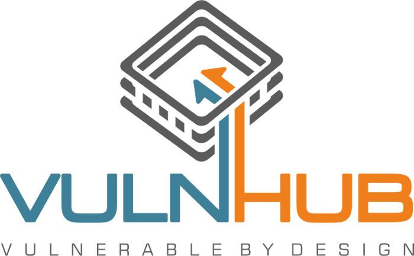

# Vulnhub

<figure><figcaption>
<a href="https://www.vulnhub.com/">https://www.vulnhub.com/</a>
</figcaption></figure>

**VulnHub** es una plataforma de ciberseguridad que proporciona una serie de máquinas virtuales y retos diseñados para poner a prueba y mejorar tus habilidades en hacking ético y seguridad informática.

## 🌟 **Características Principales**

* 🖥️ **Entornos Virtuales Desafiantes**: Explora máquinas virtuales que simulan entornos reales con vulnerabilidades para practicar la explotación de fallos y técnicas de penetración.
* 🔍 **Diversos Retos de Seguridad**: Resuelve una variedad de retos que van desde técnicas básicas de hacking hasta conceptos avanzados en criptografía, ingeniería inversa, y más.
* 📚 **Material Educativo y Tutoriales**: Accede a materiales de aprendizaje y tutoriales que te guían a través de los retos, ofreciendo explicaciones y soluciones detalladas.
* 🌐 **Comunidad Activa**: Únete a una comunidad global de entusiastas y profesionales de la ciberseguridad. Participa en foros, discute técnicas y comparte conocimientos con otros miembros.

## 🚀 **¿Por Qué Elegir VulnHub?**

**VulnHub** ofrece un entorno desafiante y educativo para quienes desean mejorar sus habilidades en ciberseguridad. Con una amplia gama de máquinas virtuales y retos, puedes practicar y perfeccionar tus habilidades de manera efectiva, ya seas un principiante o un profesional experimentado.
